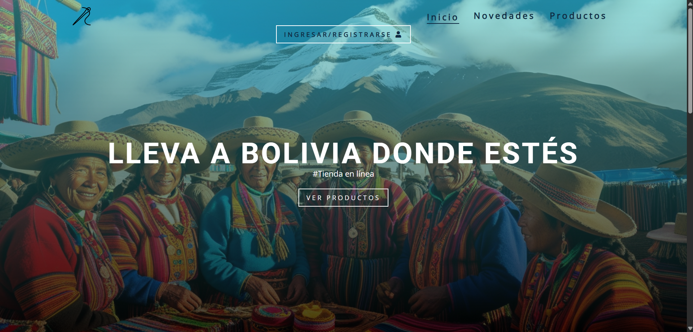
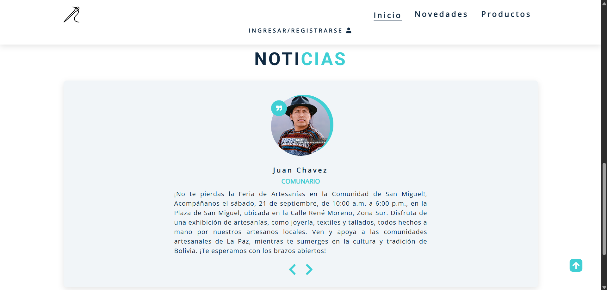
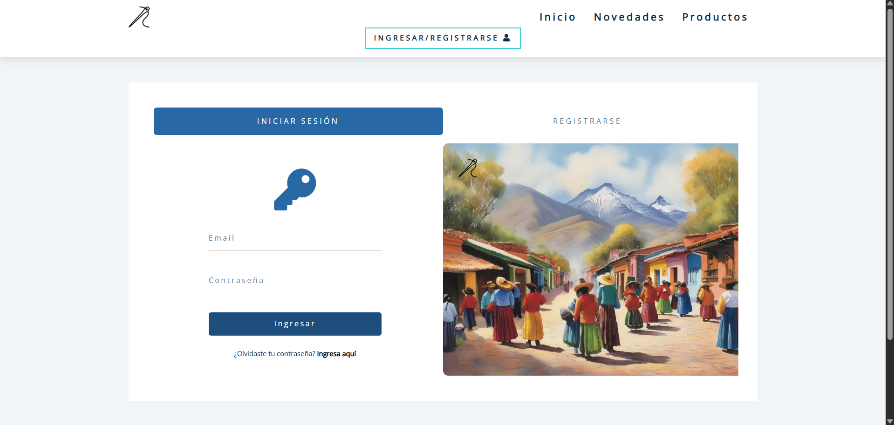

## 🏠 PROYECTO PÁGINA DE DIFUSIÓN

Este proyecto consiste en una página web estática desarrollada utilizando únicamente **HTML, CSS y JavaScript** con diseño responsivo, cuyo propósito es funcionar como una página de difusión y promoción para una tienda en línea.

---
### 🎯 Objetivo

---
El objetivo principal de esta página es brindar una plataforma atractiva y fácil de navegar donde los usuarios puedan conocer los productos que ofrece la tienda, así como obtener información relevante sobre la empresa, sus novedades y servicios, con la intención de captar el interés y generar confianza.

---
### ⚙️ Funcionalidades y secciones principales
---

La página está estructurada en varias secciones clave para ofrecer una experiencia informativa completa:

- **Inicio:** Presentación general con información sobre la misión, visión, historia y noticias relevantes de la tienda.

- **Inicio de sesión y registro:** Formularios para que los usuarios puedan acceder a su cuenta o crear una nueva. En esta versión estática, estos formularios son simulados, pero el diseño está preparado para integrar funcionalidades futuras de backend.

- **Novedades:** Muestra productos recientes y categorías, manteniendo a los visitantes informados sobre las últimas actualizaciones de la tienda.

---
### 📋 Vista previa de algunas secciones
---

---

---

